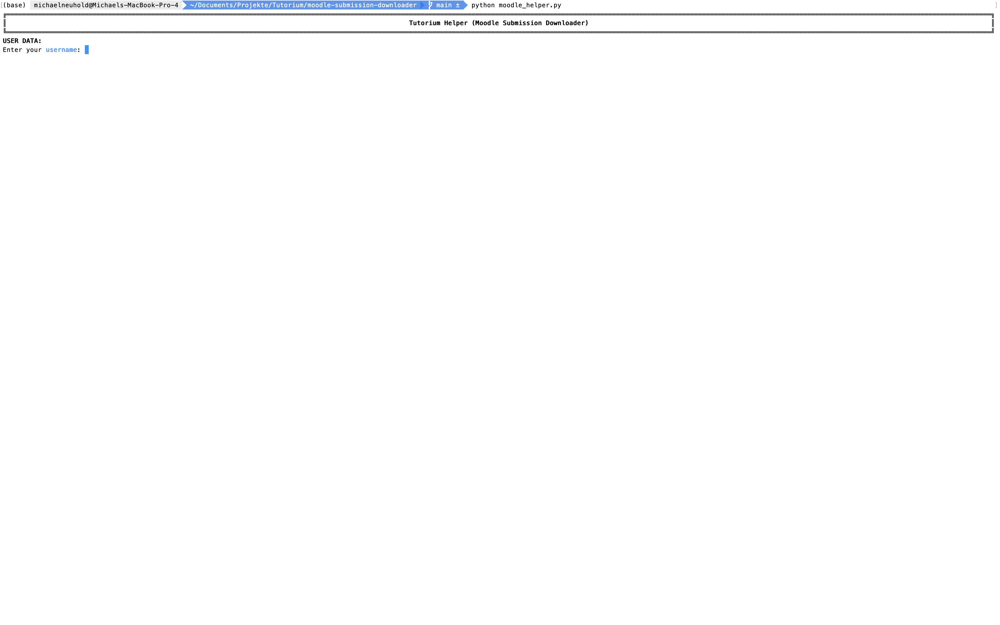
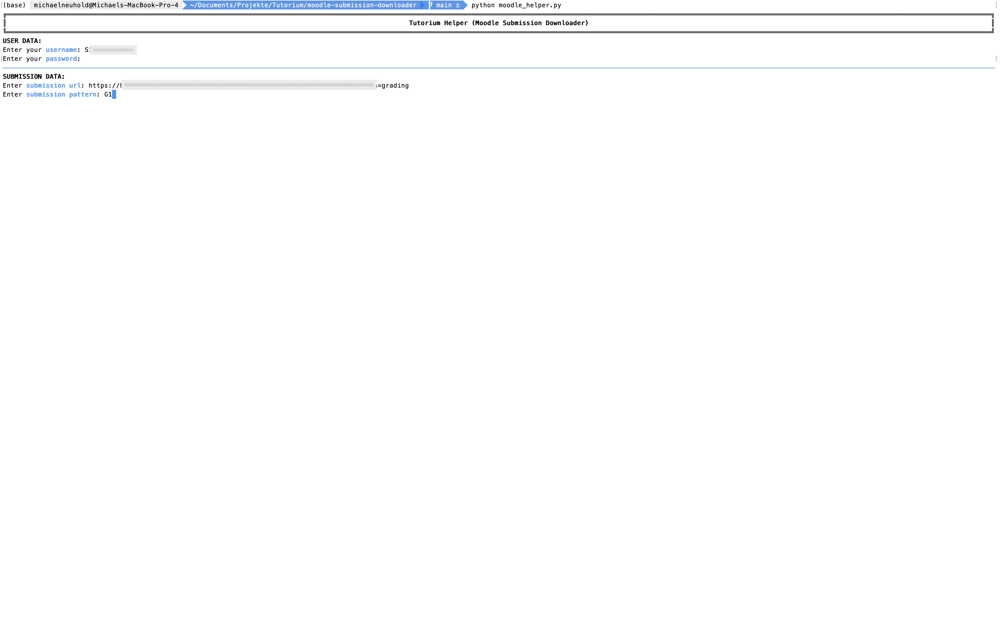
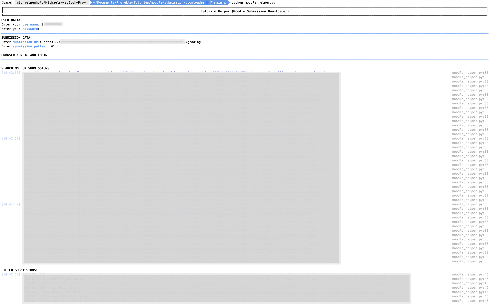
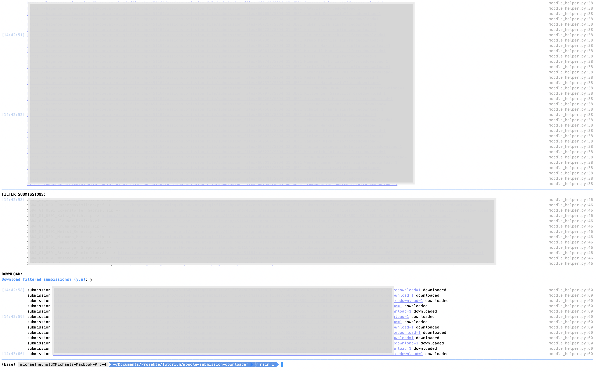

# Moodle submission downloader

## general
This tool automates the download of Moodle submissions. It uses browser-driver to
navigate to the specific moodle url. You have to enter your username and password in the console
and the tool will handle the login for you. You can specify a pattern to filter 
the submissions (eg.: G1 for group 1, or firstname, lastname).

## setup
- Python has to be installed
- You have to install a Browser-Driver like ChromeDriver (https://chromedriver.chromium.org/)
- Change the following part in the code (depending on your driver):
````python
def get_browser_driver():   
  # also other driver like ChromeDriver can be used (use correct version)
  # https://chromedriver.chromium.org/
  # eg. return webdriver.Chrome() 
  return webdriver.Safari()
````

## how to use




